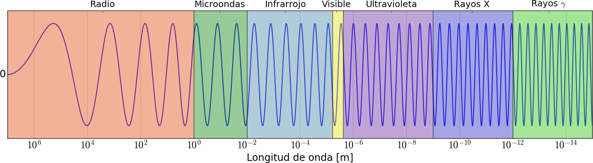
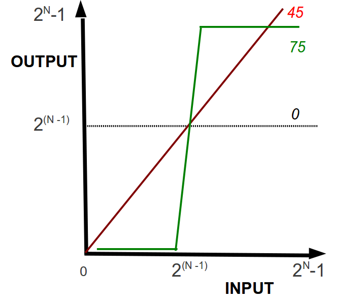
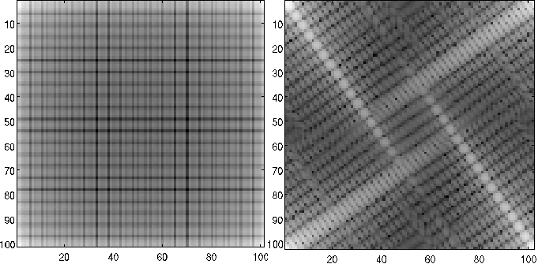

Fundamentos básicos del procesamiento de imágenes
=================================================

Una vez presentadas las bases físicas que dan lugar a la formación de
las imágenes radiológicas, en el presente Capítulo se introducirán los
primeros conceptos básicos y la formulación matemática necesaria para un
acercamiento al procesamiento de imágenes digitales. Así, se introducirá
al lector en las primeras nociones para lograr comprender la
representación y las operaciones elementales del procesamiento digital
de imágenes.

Introducción al procesamiento de imágenes
-----------------------------------------

El análisis y procesamiento de imágenes se realiza a través de
computadoras, debido a la complejidad y el número de cálculos necesarios
para realizarlo. Es por esto que, si bien la formulación matemática
necesaria para su realización data de varios siglos atrás, la
posibilidad real de utilizarla de forma cotidiana en la práctica clínica
ha sido posible recién en las últimas décadas, gracias al avance en las
tecnologías del hardware.

La proliferación de nuevos equipamientos con capacidad para realizar
millones de operaciones por segundo y su extensión a la vida cotidiana y
a todo tipo de usuario, ha hecho posible que el análisis y procesamiento
de imágenes digitales se constituya en un gran campo de estudio. En la
actualidad, esta tecnología se encuentra incorporada incluso en todo
tipo de equipamiento doméstico, como cámaras digitales, scaners y
teléfonos celulares, entre otros.

En términos históricos, la utilización de imágenes radiográficas para
diagnóstico clínico data prácticamente desde el descubrimiento de los
rayos X en 1895 (Röentgen). Incluso, las imágenes funcionales a partir
de la emisión de fotones (rayos :math:`\gamma`) por parte de
radionucleidos ya cuenta con más de 90 años de antigüedad (Heavesy &
Seaborg, 1924). Sin embargo, las imágenes eran adquiridas sobre films
radiográficos o directamente *in vivo*, por lo que su correcto
procesamiento no ha explotado su real potencialidad sino hasta la
incorporación de la tecnología que permitió digitalizarlas.

El motivo principal de esta “aparición tardía” del procesamiento de
imágenes ha sido entonces, debido a los requerimientos de hardware tanto
para el procesamiento de las mismas como para la representación de estas
en sistemas gráficos de alta performance. Paralelamente a este
desarrollo, la formulación de algoritmos para el procesamiento ha
seguido los avances tecnológicos logrando un alto grado de sofisticación
y manipulación de imágenes en tiempo casi real.

La variedad actual de técnicas, algoritmos y desarrollos de software y
hardware utilizados en el procesamiento de imágenes digitales escapa al
alcance de cualquier curso. En ellos se aprovechan técnicas
desarrolladas inicialmente sobre conceptos fundacionales para el
análisis de imágenes, y se incorporan conceptos y nociones de los más
variados, propios de la física y la matemática, como el caso de la
entropía o la métrica.

En el presente capítulo se introducirán las primeras nociones y
conceptos para abordar el estudio del procesamiento de imágenes
digitales, entre los que se cuentan las formatos de lectura y
representación de imágenes, las operaciones de modificación, las
transformaciones sobre tonalidades y colores, y la generación de efectos
sobre regiones de una imagen.

El interés del siguiente estudio puede condensarse en dos objetivos
principales: a) lograr una mejora considerable de la calidad de la
imagen para la interpretación de un especialista, y/o b) lograr la
obtención de información específica para su procesamiento por medio de
sistemas de cálculo y análisis.

Serán de interés de este curso, las imágenes producidas por interacción
de la radiación ionizante con la materia para uso médico, es decir
aquellas adquiridas por detectores de rayos X o :math:`\gamma`\  [1]_ y
que hayan atravesado -o partido de- tejido biológico de un paciente,
formando una imagen bidimensional (2D) o tridimensional (3D).

Formato de imagen y representación digital
------------------------------------------

En la actualidad, las imágenes constituyen un lenguaje en sí mismas.
Dependiendo de diferentes factores culturales, las imágenes son
utilizadas para transmitir mensajes, símbolos y distintos tipos de
información. Por esto, es necesario contar con un soporte para la
representación digital de las imágenes que permita luego modificar el
mismo a fin de o bien modificar el contenido visual y simbólico u
obtener información necesaria.

Bandas en imágenes digitales
~~~~~~~~~~~~~~~~~~~~~~~~~~~~

Para lograr adquirir una imagen, de forma remota, debe existir algún
tipo de interacción entre el objeto que se desea observar y el detector.
En las imágenes digitales, los distintos tipos de detector dependen del
tipo de radiación electromagnética que son capaces de detectar. Así como
la información que se puede obtener de un objeto depende también de la
interacción de esta radiación con el objeto. De esta particularidad
proviene el concepto de “bandas”, donde se divide el espectro
electromagnético en función de los tipos de interacción de la radiación
con la materia (ver Fig. `[fig2-1] <#fig2-1>`__), lo que define desde
los objetos a analizar hasta los detectores y materiales que pueden
utilizarse.

Todos los objetos absorben, reflejan o emiten cuantos de energía
dependiendo de su longitud de onda, intensidad y tipo de radiación. Este
tipo de radiación se define a partir de sus propiedades físicas dentro
del espectro electromagnético. El ojo humano, por su parte, solo es
capaz de detectar energía electromagnética en el espectro de luz
visible, mientras que para los rayos X, la radiación ultravioleta,
infrarroja o de microondas, es necesaria la construcción de detectores
que puedan recabar esta información, ya sea de forma digital o
analógica, para poder ser cuantificada y analizada.

   **Figura 1:** Esquema cualitativo del espectro electromagnético

Representación digital: mapa de bits (Bitmaps)
~~~~~~~~~~~~~~~~~~~~~~~~~~~~~~~~~~~~~~~~~~~~~~

Un Bitmap es un modo elemental para representar imágenes digitales como
información en el *hardware*, específicamente la memoria, de un
computador. Consiste, básicamente, en formar arreglos de elementos
(vectores, matrices, tensores) ordenados de modos específicos. En
general, para el caso típico de imágenes 2D, se realiza un ordenamiento
por filas de elementos de matriz (*pixels*) asignando a cada uno un
valor que determina “el color” en esa posición de la imagen.

En el caso de imágenes en tonalidades de grises, el valor del elemento
de matriz es un escalar; mientras que para el caso de imágenes a color
el valor de cada elemento de matriz es un vector de tres coordenadas,
cada una de las cuales especifica “el grado de influencia” de los
colores rojo (Red “R”), verde (Green “G”) y azul (Blue “B”), de modo que
se denomina representación RGB). Existen otros modos de representación a
color, como por ejemplo CMYK (cián, magenta, amarillo y negro).

Típicamente se emplean escalas (que determinan “rangos dinámicos”) en
:math:`2^{N}` bits, y se denomina :math:`N-` bits. Es decir, para el
caso más común de 8-bits, la escala es :math:`[0, 255]`, ya que por
costumbre se define el rango como :math:`[0, 2^{N} - 1]`.

El uso típico de 8-bits está basado, principalmente, en dos motivos. En
primer lugar, estudios biométricos muestran que el ojo humano no es
suficientemente sensible para diferenciar más de 256 niveles de
intensidad para un dado color. Además, el rango de valores para los
elementos de matriz determinan las necesidad en cuanto a la capacidad de
almacenamiento en el computador.

Entonces, para imágenes en tonalidades de grises, conocidas como “de una
banda” el rango para los valores de los elementos de matriz (escalares)
es :math:`[0, 255]`, mientras que para imágenes a color, los valores de
elementos de matriz (vectores de 3 coordenadas) asumen valores en
:math:`([0, 255], [0, 255], [0, 255])`. Si embargo, también es frecuente
encontrar representaciones normalizadas para imágenes a color, es decir,
elementos de matriz en :math:`([0, 1], [0, 1], [0, 1])` para determinar
los colores RGB.

Todos los colores en el rango visible pueden representarse como
combinaciones RGB, variando desde el negro :math:`(0, 0, 0)` al blanco
:math:`(255, 255, 255)`. Por lo tanto, una imagen RGB es representada
por un arreglo bidimensional de *pixels*, cada uno codificado en 3 bytes
pudiendo asumir :math:`256^{3}` diferentes valores de combinaciones
vectoriales, es decir 16.8 millones de diferentes colores,
aproximadamente.

Representación digital: imágenes vectoriales
~~~~~~~~~~~~~~~~~~~~~~~~~~~~~~~~~~~~~~~~~~~~

Las imágenes vectoriales están constituidas por contornos y rellenos
definidos matemáticamente, vectorialmente, por medio de ecuaciones que
describen perfectamente cada ilustración. De este modo, es posible
implementar *scaling* sin pérdida de calidad. El proceso de *scaling* es
típico en la formación, producción o reproducción en dispositivos. Por
ello, la importancia de mantener la invariabilidad. Esta característica
resulta de particular relevancia en casos que las ilustraciones
contengan marcadas zonas con contornos curvados, ya que el pixelado
implicaría una pérdida de resolución, como indica la figura .

   **Figura 2:** Imagen en representación vectorial (izquierda) y en pixelado bitmap (derecha).

Modificación de colores en imágenes
~~~~~~~~~~~~~~~~~~~~~~~~~~~~~~~~~~~

Es posible cuantificar la diferencia entre dos colores (en
representación digital, valores del trio vectorial RGB) calculando la
distancia, según algún tipo de métrica, Euclidea por ejemplo, entre los
vectores que los representan.

Se el color :math:`C_{1}` representado por el vector
:math:`(R_{1}, G_{1}, B_{1})` y el color :math:`C_{2}` representdo por
:math:`(R_{2}, G_{2}, B_{2})`. Entonces, en el espacio vectorial, la
distancia :math:`D (C_{1}, C_{2})` entre éstos está dada por:

.. math::

   \begin{aligned}
       D(C_{1}, C_{2}) = \sqrt{ \left(R_{1} - R_{2} \right)^{2} + \left(G_{1} - G_{2} \right)^{2} + \left(B_{1} - B_{2} \right)^{2}}
   \label{EqXXII}\end{aligned}

Para el caso particular de imágenes de una banda (tonalidades de grises)
puede aplicar la misma metodología descrita para imágenes RGB con la
simplificación asociada al hecho de que en el espacio de colores, los
vectores en la dirección del vector :math:`(1, 1, 1)` representan las
diferentes tonalidades de gris.

Por tanto, existe la equivalencia de que para cualquier *pixel* de tipo
RGB :math:`(R, G, B)` si se lo proyecta sobre :math:`(1, 1, 1)` se
obtiene la contribución de cada tonalidad de gris. Entonces, se tiene:

.. math::

   \begin{aligned}
       Proy \equiv (R, G, B) \cdot (1, 1, 1) =R + G + B = \lvert \vec{V} \rvert \lvert \hat{n} \rvert cos(\phi)
   \label{EqXXIIb}\end{aligned}

donde :math:`Proy` es la proyección, :math:`\vec{V}` es el vector que
forma el punto :math:`(R, G, B)` en el espacio de coordenadas del trío
(representación vectorial), :math:`\hat{n}` es el versor de proyección
:math:`(1, 1, 1)` y :math:`\phi` es el ángulo que forma :math:`\vec{V}`
con :math:`\hat{n}`.

De aquí puede verse que :math:`Proy = \frac{R + G + B}{\sqrt{3}}` y debe
atenderse de que este valor no exceda 255, de modo que es usual
renormalizar para obtener :math:`Proy = \frac{R + G + B}{3}`

.. raw:: latex

   \vspace{1.0cm}

.. raw:: latex

   \underline{Ejemplo de modificaci\'on de colores: Por detecci\'on de bordes}

A modo de ilustración de los conceptos generales expuestos sobre
representaciones vectoriales-bitmap, se propone un caso de aplicación
muy sencillo. Si el objetivo en la detección de bordes (orillas) de las
formas en una imagen para obtener el bitmap resultante que resalte los
bordes en blanco-negro, puede procederse del siguiente modo: Desplazarse
dentro de la imagen *pixel* a *pixel* comparando el color de cada uno
con su vecino de la derecha y su vecino de abajo. Luego, se efectúa el
siguiente control (criterio): si al comparar resulta en una diferencia
muy grande (“muy grande” es un parámetro [2]_ o conjunto de parámetros
pre-definidos por el usuario, o bien automatizados en casos más
elaborados) el *pixel* en consideración forma parte del borde y se le
asigna el color blanco, de otro modo se asigna el color negro.

Histograma de una imagen
~~~~~~~~~~~~~~~~~~~~~~~~

Dada la representación digital de una imagen por medio del arreglo de
:math:`N` filas por :math:`M` columnas se determina una matriz
:math:`M \times N`, en la cual la representación digital de bitmap
estará dada por la función distribución :math:`f(m, n)`, para
:math:`n \in [0, N-1]` y :math:`m \in [0, M-1]`, típicamente :math:`N` y
:math:`M` son potencias de 2, como ya se enunció.

El histograma de una imagen :math:`h(i)`, comúnmente denominado *“image
enhancenment”* o *“image characterization”* es un vector que da cuenta
de la cantidad de *pixels* dentro de la imagen con un cierto valor de
elemento. Es decir, para una imagen de :math:`\alpha`-bits, se tiene:

.. math::

   \begin{aligned}
       h(i) \equiv \sum _{m=0}^{M-1} \, \; \sum _{n=0}^{N-1} \delta(f(n, m) - i) \; \, \; \forall i \in [0, 2^{\alpha}-1]
   \label{EqXXIII}\end{aligned}

Una de las técnicas genéricas, que luego se diversifica a una cantidad
muy variada de metodologías específicas de procesamiento, es el método
de convolución. Sea :math:`w(k, l)` un arreglo
:math:`2 \times K + 1, 2 \times L + 1`, centrado en el “origen”
:math:`(0, 0)` que coincide con el *pixel* central de la imagen. Puede
considerarse a :math:`w(k, l)` como un *kernel* de convolución de modo
que aplicado a la imagen :math:`f(n, m)` resulte:

.. math::

   \begin{aligned}
       g(m, n) \equiv w(k, l) \ast f(m, n) = \sum _{k=-K}^{K} \, \; \sum _{l=-L}^{L} w(k, l) \cdot f(m-k, n-l)
   \label{EqXXIV}\end{aligned}

A partir de esta definición, pueden introducirse una gran cantidad de
métodos específicos, entre los que se destacan las transformadas, como
Fourier, Laplace, Radon, etc.

Resolución de una imagen
~~~~~~~~~~~~~~~~~~~~~~~~

*A priori*, este concepto tiene diferentes acepciones según el contexto
en el que se utilice y se podría definir, de modo genérico, como la
capacidad para representar o percibir los detalles de una imagen. Se
trata de un concepto presente en todo el proceso digital, desde la
captura o generación hasta la representación, y afecta (condiciona) el
procesamiento posterior.

Una definición útil es: la resolución de una imagen es la cantidad de
*pixels* que la describen. Y una medida típica es en términos de
“*pixels* por pulgada” (ppi). Por tanto, la calidad de la representación
así como el tamaño de la imagen dependen de la resolución, que determina
a su vez los reqerimientos de memoria para el archivo gráfico a generar.

Resolución, tamaño de imagen y tamaño de archivo
~~~~~~~~~~~~~~~~~~~~~~~~~~~~~~~~~~~~~~~~~~~~~~~~

Los tres conceptos están estrechamente relacionados y dependen
mutuamente, aunque se refieren a características diferenciadas y debe
evitarse la confusión.

El tamaño de una imagen son sus dimensiones reales en términos de
anchura y altura una vez impresa, mientras que el tamaño del archivo se
refiere a la cantidad de memoria física necesaria para almacenar la
información de la imagen digitalizada en cualquier soporte informático
de almacenamiento.

Ciertamente, la resolución de la imagen condiciona fuertemente estos dos
conceptos, ya que la cantidad de *pixels* de la imagen digitalizada es
fijo y por tanto al aumentar el tamaño de la imagen se reduce la
resolución y viceversa.

A modo de ejemplo: duplicando la resolución de una imagen digitalizada,
de 50 ppi a 100 ppi, el tamaño de la imagen se reduce a la cuarta parte
del original mientras que dividir la resolución por 2. Es decir, se pasa
de 300 ppi a 150 ppi obteniendo una imagen con el doble de las
dimensiones originales que represebtan cuatro veces su superficie.

La reducción de la resolución de la imagen, manteniendo su tamaño,
provoca eliminación de *pixels*. Entonces, se obtiene una representación
(descripción) menos precisa de la imagen, así como transiciones de color
más bruscas. El tamaño del archivo que genera una imagen digitalizada es
proporcional, como se espera, a la resolución, por lo tanto, variarla
implica modificar en el mismo sentido el tamaño del archivo.

Contraste en una imagen
~~~~~~~~~~~~~~~~~~~~~~~

Conceptualmente, aumentar o disminuir el contraste en una imagen
consiste, básica y visualmente, en aumentar o disminuir la pendiente de
la linea recta con pendiente a 45 grados que representa los grises (con
la precaución de no exceder los límites 0-255) entre *input* y *output*,
como indica la figura `[Fig2_2] <#Fig2_2>`__.

La transformación correspondiente al cambio de contraste es:

.. math::

   \begin{aligned}
       V_{O}(m, n) = \left( V_{I}(m, n) - 2^{Y - 1} \right) \, \tan{\phi} \, + 2^{Y - 1}
   \label{EqXXV}\end{aligned}

donde :math:`Y` es la escala en bits, :math:`V_{I}` y :math:`V_{O}` son
los valores de *input* y *output*, respectivamente valuados en el pixel
:math:`(m, n)`; y el ángulo :math:`\phi` cooresponde a las propiedades
de la transformación lineal de contrastes, específicamente la pendiente
(figura `[Fig2_2] <#Fig2_2>`__).

   **Figura 3:** Representación del cambio de contraste entre *input* y *output*.

Vínculo físico del origen de imágenes
-------------------------------------

Las imágenes generadas por radiación electromagnética pueden clasifcarse
en modo genérico según el ordenamiento de mayor a menor frecuencia.

Rayos :math:`\gamma`
    medicina nuclear, observaciones de astronomía.

Rayos X
    diagnóstico médico e industria (control de calidad).

Banda ultravioleta
    Inspección industrial y microscopía biológica.

Banda visible e infrarroja
    Aplicaciones varias, fotografía.

Microondas
    radar.

Ondas de radio
    medicina (MRI) y algunas aplicaciones en astronomía.

Modificación de una imagen
--------------------------

Una imagen *input* puede ser modifica por medio de diferentes maneras,
según la/s propiedad/es que se modifica/n.

En particular, se consideran a continuación algunas de las
modificaciones más frecuentes.

Modificación de colores o tonalidades: Corrección :math:`\gamma`
~~~~~~~~~~~~~~~~~~~~~~~~~~~~~~~~~~~~~~~~~~~~~~~~~~~~~~~~~~~~~~~~

.. raw:: latex

   \markboth{Intr. proc. im\'agenes radiol\'ogicas \'ambito m\'edico \ \textbf{M\'ODULO II}}{ESPECIALIDAD III \ \textbf{M\'ODULO II}}

Existe una amplia variedad de técnicas y criterios para modificar los
colores de una imagen. Una de las metodologías más empleada, y sencilla,
es la corrección :math:`\gamma`, definida a partir de:

.. math::

   \begin{aligned}
       V_{O}(m, n) = \left( 2^{N} - 1 \right) \left( \frac{V_{I}(m, n)}{2^{N} -1} \right)^{\frac{1}{\gamma}}
   \label{EqXXVI}\end{aligned}

donde el índice :math:`\gamma` asume valores :math:`\in \Re`.

Por lo tanto, resulta:

-  Para :math:`\gamma` = 1 no hay ninguna corrección.

-  Para valores de :math:`\gamma > 1` hay una gran corrección en el
   contraste para valores pequeños del color de *input* mientras que una
   pequeña corrección en el contraste para valores altos. El brillo
   aumenta más para valores intermedios del color de *input*.

-  Para valores de :math:`\gamma < 1` hay una pequeña corrección en el
   contraste para valores bajos del color de *input*, mientras que una
   gran corrección en el contraste para valores altos. El brillo
   disminuye más para valores intermedios del color de *input*.

Modificación de imagen: inversión (*flip*)
~~~~~~~~~~~~~~~~~~~~~~~~~~~~~~~~~~~~~~~~~~

Básicamente, esta modificación consiste en una transformación que
produce un “movimiento” de la columna :math:`m`, fila :math:`n` a la
columna :math:`m` y fila :math:`(n_{max} - n) + 1`, para :math:`n_{max}`
como la dimensión en la dirección de :math:`n`.

Es decir,

.. math::

   \begin{aligned}
       V_{flip}(m, n) = V_{I} (m, (n_{max} - n) + 1)
   \label{EqXXVII}\end{aligned}

donde :math:`V_{flip}` es la matriz de output que corresponde a la
transformación de inversión.

Modificación de imagen: reflexión (*mirror*)
~~~~~~~~~~~~~~~~~~~~~~~~~~~~~~~~~~~~~~~~~~~~

Básicamente, esta modificación consiste en una transformación que
produce un “movimiento” de la fila :math:`n`, columa :math:`m` a la fila
:math:`n` y columna :math:`(m_{max} - m) + 1`, para :math:`m_{max}` como
la dimensión en la dirección de :math:`m`.

Es decir,

.. math::

   \begin{aligned}
       V_{mirror}(m, n) = V_{I} ((m_{max}  - m) + 1, n)
   \label{EqXXVIII}\end{aligned}

donde :math:`V_{mirror}` es la matriz de output que corresponde a la
transformación de reflexión.

Modificación de imagen: interpolación
~~~~~~~~~~~~~~~~~~~~~~~~~~~~~~~~~~~~~

A partir de de un muestreo *input* pueden estimarse los valores de la
intensidad en puntos diferentes a aquellos puntos donde si se conoce el
valor Entre otras técnicas, se destacan los métodos de *re-sampling*.

De este modo, se emplean diferentes criterios para determinar los
valores :math:`V_{O}(k, l)` para *pixels* :math:`(k, l)` donde el
*input* :math:`V_{I}` no es conocido:

-  Interpolación al vecino más cercano.

-  Interpolación bilineal.

-  Interpolación bicúbica.

La técnica de interpolacoón al vecino más cercano (*Nearest neighbor
interpolation*) está basada en superponer el arreglo 2D *output* al
arreglo 2D *input* calculando el valor para los *pixels* :math:`(k, l)`
según los valores conocidos :math:`V_{I}(i, j)`, utilizando un promedio
(que puede cuantificarse de diferentes maneras) de los vecinos más
cercanos equidistantes. Sin embargo, puede verse que esta técnica
presenta algunos efectos indeseables.

La tácnica de interpolación lineal considera los 4 *pixels* más cercanos
a :math:`V(k, l)` para la interpolación. Se realiza un promedio entre
estos 4 valores para determinar el valor desconocido del *pixel*
:math:`(k, l)`. La imagen *output* resulta más “suave” que para el caso
de la técnica *Nearest neighbor interpolation*. Pero, puede causar que
la imagen se vea algo “difusa”.

Entonces, los valores de *pixels* :math:`(k, l)`, para los cuales no se
conoce :math:`V_{I}(k, l)` se obtienen a partir de:

.. math::

   \begin{aligned}
       V_{O}(k, l) = (1 - \alpha)\, (1-\beta) \, V_{I}(i,j) + \alpha (1 - \beta) \, V_{I}(i +1, j) + \nonumber \\
       (\alpha -1) \, V_{I}(i, j+1) + \alpha \, \beta \, V_{I}(i +1, j +1)
   \label{EqXXIX}\end{aligned}

donde :math:`\alpha \equiv k - i`, :math:`\beta \equiv l -j`,
:math:`i \equiv floor(k)` y :math:`j \equiv floor(l)`\  [3]_.

Por su parte, la técnica de interpolación bicúbica Es el algoritmo de
interpolación más utilizado. Considera los 16 *pixels* más cercanos a
cada *pixel* :math:`(k, l)` cuyo valor debe determinarse por
interpolación. Se aproxima localmente al valor (el nivel de gris) en la
imagen original mediante una superficie polinómica de tipo bicúbica.
Resulta ser, de las técnicas quí descritas, el óptimo al considerar el
balance entre tiempo de cómputo y *performance*.

La implementación de este método puede llevarse a cabo por medio de
procesar el bloque :math:`B(k, l)`, centraado en el *pixel*
:math:`(k, l)`, cuyas dimensiones se corresponden con las dimensiones de
la máscara (16 *pixels* en un arreglo 5 :math:`\times` 5):

.. math::

   \begin{aligned}
       B(k, l) = \sum _{i=0}^{3} \sum _{j=0}^{3} \,
   q^{(k, l)}_{i, j} (k - k')^{i} \, (l - l')^{j} \\ \nonumber
   \, \, \; \; k', \,  \in [k - 2, k + 2] \; \, \& \;
   l' \,  \in [l - 2, l + 2]
   \label{EqXXX}\end{aligned}

donde los coeficientes :math:`q_{i, j}` deben ser determinados. O bien,

.. math::

   \begin{aligned}
       V_{O}(k, l) = h(k) \, h(l)
   \label{EqXXXI}\end{aligned}

donde la función de interpolación :math:`h` se define, a trozos, del
siguiente modo:

.. math::

   \begin{aligned}
       h(p) \equiv 1 - \, \lvert p \rvert^{2} + \lvert p \rvert^{3} \; \, \; \forall \lvert p \rvert < 1 \nonumber \\
       h(p) \equiv 4 - \, 8 \, \lvert p \rvert^{2} + 5 \, \lvert p \rvert^{2} - \lvert p \rvert^{3} \; \, \; \forall 1 \leq \lvert p \rvert < 2 \\
       h(p) \equiv 0 \, \; \, \forall p \geq 2 \nonumber
   \label{EqXXXII}\end{aligned}

Comparación cualitativa de performance de algoritmos de interpolación
~~~~~~~~~~~~~~~~~~~~~~~~~~~~~~~~~~~~~~~~~~~~~~~~~~~~~~~~~~~~~~~~~~~~~

-  Interpolación de vecino más cercano: El error de posición resulta, a
   los sumo, medio *pixel*, que es perceptible en objetos con fronteras
   rectas en las que aparece un efecto de salto después de de esta
   transformación.

-  Interpolación Lineal: Genera una leve disminución de resolución
   debido al borroneo (*blurring*) intrínseco al modo de cálculo del
   valor promedio, pero disminuye el efecto de salto que presenta el
   algoritmo de vecino más cercano.

-  Interpolación Bicúbica: No presenta el problema del efecto de salto a
   la vez que genera un menor *blurring*.

Relaciones básicas entre pixels
-------------------------------

La relación básica más inmediata entre *pixels* es la distancia
:math:`D` entre dos *pixels* :math:`(m, n)` y :math:`(m', n')`.

Los axiomas para definir una métrica o función de distancia entre
*pixels* :math:`D` requieren de los siguientes criterios:

-  :math:`D(k \; k', l \; l') \geq 0` con
   :math:`D(k \; k', l \; l') = 0 \Leftrightarrow k=k' \, \; l=l'`

-  :math:`D(k \; k', l \; l') = D(k' \; k, l' \; l)`

-  :math:`D(k \; k', l \; l') \leq D(k \; k', s \; s') + D(s \; s', l \; l')`

A partir de estas condiciones pueden definirse diferentes métricas.
Entre ellas:

.. raw:: latex

   \underline{Distancia Euclidea}

.. math::

   \begin{aligned}
       D(k \; k', l \; l') \equiv \sqrt{\left( k - k' \right)^2 + \left( l - l' \right)^2}
   \label{EqXXXIII}\end{aligned}

.. raw:: latex

   \underline{Distancia $D_{4}$}

.. math::

   \begin{aligned}
       D_{4}(k \; k', l \; l') \equiv \lvert k - k' \rvert + \lvert l - l' \rvert
   \label{EqXXXIV}\end{aligned}

.. raw:: latex

   \underline{Distancia $D_{8}$}

.. math::

   \begin{aligned}
       D_{8}(k \; k', l \; l') \equiv \max \left( \lvert k - k' \rvert , \lvert l - l' \rvert \right)
   \label{EqXXXIV}\end{aligned}

Las definiciones Euclidea, :math:`D_{4}` y :math:`D_{8}` para la
distancia entre *pixels* no depende de adyacencias sino exclusivamente
de las coordenadas espaciales :math:`(k, l)`.

Puede verse, a partir de las definiciones de las métricas que la
condición :math:`D(k \, k', l \, l') \leq. R` determina un círculo
centrado en :math:`(k, l)` para la métrica Euclidea, un rombo para la
métrica :math:`D_{4}` y un cuadrado para la métrica :math:`D_{8}`.

Operadores sobre imágenes
-------------------------

Para operar sobre imágenes pueden utilizarse herramientas basadas en
operaciones matriciales de álgebra lineal y operaciones “de array”
orientadas *pixel a pixels*. :math:`\mathbf{H}` es un operador
arbitrario sobre una imagen cuya representación matricial es
:math:`f(m, n)` si satisface:

.. math::

   \begin{aligned}
       \mathbf{H} \left[ f(m, n) \right] = g(m, n)
   \label{EqXXXV}\end{aligned}

Además, :math:`\mathbf{H}` es un operador lineal si:

.. math::

   \begin{aligned}
       \mathbf{H} \left[ \sum _{j} \alpha_{j} f_{j}(m, n) \right] = \sum _{j} \alpha_{j} \; \mathbf{H} \left[ f_{j}(m, n) \right]
   \label{EqXXXVI}\end{aligned}

Una aplicación importante de las propiedades de linealidad de operadores
sobre imágenes es la descripción de imágenes :math:`g(m, n)` como
contribución “original” (:math:`f(m, n)`) y ruido *random*
(:math:`r(m, n)`):

.. math::

   \begin{aligned}
       g(m, n) = f(m, n) + r(m, n)
   \label{EqXXXVII}\end{aligned}

La imagen de ruido es de tipo *random* si los valores de *pixels* de
:math:`r(m, n)` son aleatorios no correlacionados y con esperanza 0.

Promediando :math:`N_{Tot}` imágenes con ruido *random* se obtiene la
imagen promedio :math:`\langle g \rangle` dada por:

.. math::

   \begin{aligned}
       \langle g \rangle (m, n) = \frac{1}{N_{Tot}} \sum _{j=1} ^{N_{Tot}} g_{j} (m, n)
   \label{EqXXXVIII}\end{aligned}

La aplicación del teorema del límite central establece que la imagen
promedio :math:`\langle g \rangle (m, n) \; \rightarrow f(m, n)` (imagen
“original”) para :math:`N_{Tot} \rightarrow \infty`.

Otra aplicación útil de los operadores lineales es la substracción de
una máscara [4]_ :math:`M(m, n)` a la imagen original :math:`f(m, n)`:

.. math::

   \begin{aligned}
       g (m, n) = f(m, n) - M(m, n)
   \label{EqXXXIX}\end{aligned}

Adición y diferencia de imágenes
~~~~~~~~~~~~~~~~~~~~~~~~~~~~~~~~

Para ejemplificar las operaciones, se utilizan imágenes 8-bits.

Por tanto, los valores de la imagen resultado de la adición de dos
imágenes varían en :math:`[0, 510]`. Mientras que los valores de la
imagen resultado de la diferencia de dos imágenes varían en
:math:`[-255, 255]`.

La adecuación (:math:`f_{A}`) de los valores de la imagen resultado de
adición/diferencia de dos imágenes se realiza del siguiente modo:

.. math::

   \begin{aligned}
       f_{A} (m, n) = round \left[ \left( 2^{N} - 1 \right)
                   \frac{f(m, n) - min{ \left[ f(m, n) \right] }}{max{ \left[ f(m, n) - min{f(m, n)} \right] }} \right]
   \label{EqXL}\end{aligned}

Para imágenes de tipo :math:`N`-bits.

Operaciones sobre pixels
------------------------

La introducción de operaciones espaciales que se llevan a cabo sobre los
valores de *pixels* de la imagen permiten:

-  Operaciones de un *pixel*.

-  Operaciones de vecindad.

-  Transformaciones geométricas.

Operaciones de un *pixel*

Se modifica el valor de un *pixel* de modo individual en la imagen
original :math:`f(m, n)`, dando como resultado :math:`g(m, n)` dado por:

.. math::

   \begin{aligned}
       g (m, n) = \mathbf{T} \left( f(m, n) \right)
   \label{EqXLI}\end{aligned}

de manera que el valor de imagen es modificado por la transformación
:math:`\mathbf{T}`. Este concepto se aplica, por ejemplo, para
determinar “el negativo”

Operaciones de vecindad

Sea :math:`C (M, N)` un conjunto de *pixels*
(:math:`M := [m_{min}, m_{max}]` y :math:`N := [n_{min}, n_{max}]`)
entorno (vecinos) al *pixel* :math:`(m, n)`.

A partir de este tipo de operaciones de vecinos puede calcularse, por
ejemplo, el valor medio en un entorno rectangular (:math:`M \times N`)
de un *pixel* de interés [5]_. Resulta:

.. math::

   \begin{aligned}
       g (m, n) = \frac{1}{ M \; N} \sum _{(i, j) \in C(M, N)} f(i, j)
   \label{EqXLII}\end{aligned}

Transformaciones geométricas.

Las transformaciones geométricas :math:`\mathbf{T}` de una image
:math:`f(m, n)` puede obtenerse a partir de una transformación de índole
geométrico de coordenadas espaciales: al valor del *pixel*
:math:`(m, n)` se asigna el valor de un *pixel* :math:`(i, j)`.

Debido a la naturaleza discreta de la representación de imágenes, debe
considerarse el proceso de interpolación para obtener los valores de
*pixels* como resultado de aplicar l transformación :math:`\mathbf{T}`.

Una de las categorías principales de los operadores de transformación
son las transformaciones denominadas afines, que incluyen translaciones,
rotaciones, escalados, reflexiones y proyecciones, entre otros.

Algunos ejemplos de operadores de transformación son:

-  Rotación:
   :math:`\mathbf{T_{Rot}} = \begin{array}{cc} \cos(\theta) & \sin(\theta)  \\  -\sin(\theta) & \cos(\theta) \\ \end{array}`

-  Escaleo:
   :math:`\mathbf{T_{Esc}} = \begin{array}{cc} e_{i} & 0  \\  0 & e_{j} \\ \end{array}`

-  Traslación:
   :math:`\mathbf{T_{Tra}} = \begin{array}{ccc} 1 & 0 & 0 \\  0 & 1 & 0 \\ t_{i} & t_{j} & 0 \\ \end{array}`

Transformadas dicretas: La transformada de Fourier
--------------------------------------------------

Desde un punto de vista general, las transformadas constituyen
operaciones espaciales sobre una imagen original :math:`f(m, n)`,
representada en el dominio espacial (que se refiere a las coordenadas
:math:`(m, n)`) y una imagen resultado :math:`F(m, n)` que procesan los
valores de *pixels* en el plano geométrico.

Existen diferentes modos de representar de la imagen, en términos del
espacio ce representación:

#. la imagen :math:`f(m, n)` es representada por una matriz
   :math:`M \times N` de *pixels* :math:`(m, n)` discretos.

#. la imagen :math:`F(m*, n*)` es representada por una matriz
   :math:`M \times N` de variables transformadas :math:`(m*, n*)`.

Como se introdujo de modo cualitativo (`[EqXXV] <#EqXXV>`__ y
`[EqXXVI] <#EqXXVI>`__), una transformación lineal de una imagen
original :math:`f(m, n)` significa‘:

.. math::

   \begin{aligned}
       F (m*, n*) = \sum _{m} \sum _{n} f(m, n) \, k(m \; m*, n \; n*)
   \label{EqXLIII}\end{aligned}

donde :math:`k` es el *kernel* de la transformación.

La transformada directa (*fordward*) de :math:`f(m, n)` deviene en
:math:`F(m*, n*)`, y la transformada inversa (*inverse*) de
:math:`F(m*, n*)` deviene en :math:`f(m, n)`. Por tanto, el equivalente
a la expresión (`[EqXLIII] <#EqXLIII>`__) es:

.. math::

   \begin{aligned}
       f (m, n) = \sum _{m*} \sum _{n*} F(m*, n*) \, k(m* \; m, n* \; n)
   \label{EqXLIV}\end{aligned}

donde :math:`k(m* \; m, n* \; n)` es el *kernel* de la transformación
inversa.

De este modo, se habilita la posibilidad de operar en el espacio de la
transformada. Es decir:

.. math::

   \begin{aligned}
       f (m, n) \; \underrightarrow{\mathbf{T}} \; \; F(m*, n*) \; \underrightarrow{\mathbf{O}} \; \; G(m*, n*) \;
       \underrightarrow{\mathbf{T^{-1}}} \; \; g(m, n)
   \label{EqXLV}\end{aligned}

donde :math:`\mathbf{T}` y :math:`\mathbf{T^{-1}}` representan la
transformada directa e inversa, respectivamente. :math:`\mathbf{O}` es
un operador arbitrario.

Resulta de particular importancia la propiedad de los *kernels* de ser
separable en variables. Es decir:

.. math::

   \begin{aligned}
       k (m \; m*, n \; n*) = k_{(m, n)} (m, n) \;  k_{(m*, n*)} (m*, n*)
   \label{EqXLVI}\end{aligned}

La transformada discreta de Fourier bidimensional 2D se define a partir
de los *kernels* de transformación:

.. math::

   \begin{aligned}
       k_{TF} (m \; m*, n \; n*) = e^{-2 \pi i \left( \frac{m \, m*}{M} + \frac{n \, n*}{N}\right)} \nonumber \\
       k_{(TF)^{-1}} (m \; m*, n \; n*) = \frac{1}{M \, N}e^{2 \pi i \left( \frac{m \, m*}{M} + \frac{n \, n*}{N}\right)}
   \label{EqXLVII}\end{aligned}

Por tanto, la operación de transformadas discretas directa
(:math:`\mathbf{TF}`) e inversa (:math:`\mathbf{(TF)^{-1}}`) resultan:

.. math::

   \begin{aligned}
       F(m*, n*) = \sum _{m} ^{M-1} \sum _{n} ^{N-1} f(m, n) \; e^{-2 \pi i \left( \frac{m \, m*}{M} + \frac{n \, n*}{N}\right)} \nonumber \\
       f(m, n) = \frac{1}{M \, N} \sum _{m*} ^{M-1} \sum _{n*} ^{N-1} F(m*, n*) \; e^{2 \pi i \left( \frac{m \, m*}{M} + \frac{n \, n*}{N}\right)}
   \label{EqXLVIII}\end{aligned}

Cuyo análogo en espacios continuos es:

.. math::

   \begin{aligned}
       F(u, v) = \mathbf{TF}[f(x, y)] = \int_{-\infty}^{\infty} \int_{-\infty}^{\infty} f(x, y) \; e^{-2 \pi \i (u \, x + v \, y)} \; dx dy \nonumber \\
       f(x, y) = \mathbf{(TF)^{-1}}[F(u, v)] = \frac{1}{4 \pi^{2}} \int_{-\infty}^{\infty} \int_{-\infty}^{\infty} F(u, v) \;
       e^{2 \pi i (u \, x + v \, y)} \; du dv
   \label{EqLI}\end{aligned}

La expresión (`[EqXLIX] <#EqXLIX>`__) para la transformada de Fourier
puede interpretarse, dejando de lado momentaneamente problemas de
existencia y unicidad, como una suma de exponenciales complejas con
pesos para los términos, donde las variables :math:`m*` y :math:`n*`
representan las frecuencias en el dominio de la transformada.

El valor de la transformada en :math:`(m*, n*)` (:math:`F(m*, n*)`)
contribuye a través de
:math:`F(m*, n*) \, e^{2 \pi i (u \, x + v \, y)}` y puede verse, ya que
:math:`f(m, n)` es una función real, que
:math:`F(m*, n*) = F^{\prime} (m*, n*)`, donde :math:`\prime` indica el
complejo conjugado.

A modo de ejemplo, la figuras `[Fig2_3] <#Fig2_3>`__,
`[Fig2_4] <#Fig2_4>`__ y `[Fig2_5] <#Fig2_5>`__ presentan resultados de
aplicar la transformada de Fourier de la imagen orifinal :math:`f(m, n)`
para diferentes casos.

   **Figura 4:** Ejemplo de transformada de Fourier:
   :math:`f(m, n) = 0`; :math:`\forall (m, n) \neq (51, 51)`;  :math:`m, n \in [1, 101]`
   obtenido con plataforma MatLab [*]_.

   **Figura 5:** Ejemplo de transformada de Fourier:
   :math:`f(m, n) = 0`; :math:`\forall (m, n) \neq (40, 51)`, :math:`\vee \neq (60, 51)`; :math:`m, n \in [1, 101]` obtenido con plataforma MatLab.

   **Figura 6:** Ejemplo de transformada de Fourier:
   :math:`f(m, n) = 0`; :math:`\forall (m, n) \neq (51, 40)`, :math:`\vee \neq (51, 60)`; :math:`m,n \in [1, 101]` obtenido con plataforma MatLab.

Filtros
-------

A partir de las definiciones introducidas por las expresiones
(`[EqL] <#EqL>`__) y (`[EqLI] <#EqLI>`__) resulta posible realizar
procesos de filtrado tanto en el dominio especial de la imagen original
:math:`f(m, n)` como en el dominio de las frecuencias de la transformada
:math:`F(m*, n*)`.

Una característica significativa, que representa de hecho una de las
principales ventajas de los espacios de transformadas, es que la
operación de filtrado se realiza por medio de una multiplicación de
transformadas; mientras que la operación en el espacio de coordenadas
significa una convolución denotada por el símbolo :math:`\otimes`. En
virtud del teorema de convolución, se tiene:

.. math::

   \begin{aligned}
       f(m, n) \otimes g(m, n) = \int_{-\infty}^{\infty} \int_{-\infty}^{\infty} f(m, n) \; g(m-k, n-l)\; dk \, dl
   \label{EqLII}\end{aligned}

Aplicando la definición de transformada de Fourier, se obtiene:

.. math::

   \begin{aligned}
       F_{f, g}(m*, n*) \equiv \mathbf{TF} [ f(m, n) \otimes g(m, n) ] =  \nonumber \\
       \mathbf{TF} [ f(m, n)] \; \mathbf{TF} [ g(m, n)] = F(m*, n*) \; G(m*, n*)
   \label{EqLIII}\end{aligned}

Para una dada función original :math:`f(m, n)` y su correspondiente
transformada de Fourier :math:`F(m*, n*)`, en referencia a la expresión
(`[EqLIII] <#EqLIII>`__) el operador :math:`G(m*, n*)` se define como un
*filtro espacial lineal* o *función de transferencia* de filtro.

Entonces, la imagen resultado del proceso de filtrado :math:`h(m, n)` se
obtiene aplicando la transformada inversa:

.. math::

   \begin{aligned}
       h(m, n) = \mathbf{TF^{-1}} [F_{f, g}(m*, n*) ]
   \label{EqLIV}\end{aligned}

El filtro queda determinado por medio de la función de transferencia o
bien por la *respuesta de impulso* :math:`j(m, n)` definida a partir de:

.. math::

   \begin{aligned}
       j(m, n) = F_{f, g}(m, n) = \delta (m, n) \otimes j(m, n) =  \nonumber \\
       \int_{-\infty}^{\infty} \int_{-\infty}^{\infty} \delta(m, n) \, j(k-m, l-n) \; dk \, dl
   \label{EqLV}\end{aligned}

Resulta que :math:`j(m, n)` es un filtrado intenso en términos de la
función :math:`\delta` de Dirac.

A fines de cómputo, la transformada discreta de Fourier puede obtenerse,
en modo análogo a la expresión (`[EqXLVIII] <#EqXLVIII>`__) operando:

.. math::

   \begin{aligned}
       F(m^*, n^*) = \mathbf{TF}[f(m, n)] = \frac{1}{M \, N} \sum_{m=0}^{M-1} \sum_{n=0}^{N-1} f(m, n) \; \nonumber \\
       \left[ \cos \left( 2 \pi  (\frac{m^* \, m}{M} + \frac{n^* \, n}{N}) \right) +
       i \, \sin \left( 2 \pi  (\frac{m^* \, m}{M} + \frac{n^* \, n}{N}) \right)\right] \nonumber \\
       f(m, n) = \mathbf{TF^{-1}} [F(m^*, n^*)] = \sum_{m=0}^{M-1} \sum_{n=0}^{N-1} F(m^*, n^*) \; \nonumber \\
       \left[ \cos \left( -2 \pi  (\frac{m^* \, m}{M} + \frac{n^* \, n}{N}) \right) -
       i \, \sin \left( 2 \pi  (\frac{m^* \, m}{M} + \frac{n^* \, n}{N}) \right)\right] \nonumber \\
   \label{EqLVI}\end{aligned}

Debido a la naturaleza discreta del espacio de muestreo intrínseco al
procesamiento digital de imágenes, se determina la relación entre
dominios espaciales y de frecuencias por medio de:

.. math::

   \begin{aligned}
       \Delta m^* = \frac{1}{M\; \Delta m}  \\
       \Delta n^* = \frac{1}{N\; \Delta n}
   \label{EqLVII}\end{aligned}

Cabe destacar que, por conveniencia de procesamiento, para el caso de
imágenes “cuadradas” para las que :math:`N = M`, se redefine la
expresión para la transformada de Fourier, multuplicando la expresión
(`[EqLVI] <#EqLVI>`__) por :math:`N`, es decir:

.. math::

   \begin{aligned}
       F(m^*, n^*) = \mathbf{TF}[f(m, n)] = \frac{1}{N} \sum_{m=0}^{N-1} \sum_{n=0}^{N-1} f(m, n) \;
       e^{-2 \pi \, i \, \left( \frac{m^* \, m + n^* \, n}{N} \right)} \nonumber \\
       f(m, n) = \mathbf{TF^{-1}} [F(m^*, n^*)] = \frac{1}{N} \sum_{m=0}^{N-1} \sum_{n=0}^{N-1} F(m^*, n^*) \;
       e^{2 \pi \, i \, \left( \frac{m^* \, m + n^* \, n}{N} \right)} \nonumber \\
   \label{EqLVIII}\end{aligned}

La componente espectral compleja de :math:`F(m^*, n^*)` determina módulo
y fase, respectivamente, dados por:

.. math::

   \begin{aligned}
       \lvert F(m^*, n^*) \rvert = \sqrt{\left[ \Re{ \left( F(m^*, n^*) \right) }\right]^{2} +
       \left[ \Im{\left( F(m^*, n^*) \right) } \right]^{2}} \nonumber \\
       \phi(m^*, n^*) = \arctan \left[ \frac{\Im{\left( F(m^*, n^*) \right) }}{\Re{\left( F(m^*, n^*) \right) }}\right]
   \label{EqLIX}\end{aligned}

donde :math:`\Im` y :math:`\Re` representan las componentes imaginaria y
real, respectivamente. Al filtrar una imagen original cuadrada
:math:`f(m, n)` de dimensiones :math:`N \times N` mediante un filtro
:math:`j(m, n)` de dimensiones :math:`L \times L` se obtendrá una imagen
resultado :math:`g(m, n)` de dimensiones
:math:`N + L -1 \; \; \times \; \; N + L -1`.

Las propiedades de la transformada de Fourier permiten identificar de
modo sencillo los operadores más relevantes del procesamiento digital,
como:

.. raw:: latex

   \vspace{1.0cm}

.. raw:: latex

   \underline{Operador de Traslaci\'on}

.. raw:: latex

   \vspace{0.5cm}

.. math::

   \begin{aligned}
       f(m, n)e^{2 \pi \, i (\frac{m^* _{0} \, m + n^* _{0} \, n}{N})} \leftrightarrow F(m^* - m^* _{0}, n^* - n^* _{0}) \\
       f(m - m_{0}, n - n_{0}) \leftrightarrow F(m^*, n^*) \, e^{-2 \pi \, i (\frac{m^* \, m_{0} + n^* \, n_{0}}{N})} \nonumber
   \label{EqLX}\end{aligned}

Es decir, una traslación al punto :math:`(m_{0}, n_{0})` se identifica
con con el corrimiento del origen del plano del dominio de frecuencias
al punto :math:`(m^*_{0}, n^*_{0})`.

.. raw:: latex

   \underline{Operador de Rotaci\'on}

.. raw:: latex

   \vspace{0.5cm}

En coordenadas polares
:math:`m = \rho \, \cos{\theta} \; \; n = \rho \, \sin{\theta} \; \; m^* = \omega \, \cos{\phi} \; \; n^* = \omega \, \sin{\phi}`,
las imágenes original :math:`f(m, n)` y transformada :math:`F(m^*, n^*)`
son expresadas como :math:`f(\rho, \theta)` y :math:`F(\omega, \phi)`.

Aplicando la definición de transformada de Fourier, resulta:

.. math::

   \begin{aligned}
       f(\rho, \theta + \theta_{0}) \leftrightarrow F(\omega, \phi + \theta_{0})
   \label{EqLXI}\end{aligned}

Es decir, la rotación de la imagen original :math:`f(\rho, \theta)` (o
:math:`f(m, n)`) por un ángulo :math:`\theta_{0}` se vincula con una
rotación del mismo ángulo en la imagen resultante
:math:`F(\omega, \phi)` (o :math:`F(m^*, n^*)`).

Las figuras `[Fig2_6] <#Fig2_6>`__ y `[Fig2_7] <#Fig2_7>`__ muestran
ejemplos de aplicación de operadores de rotación, en dominio de
coordenadas y de frecuencias, respectivamente.

   **Figura 7:** Rotación de :math:`35^{\deg}` de una imagen original :math:`f(m, n)`
   (o :math:`f(\rho, \theta)`) obtenido con plataforma MatLab.

   **Figura 8:** Rotación de :math:`35^{\deg}` de una imagen en dominio de transformada
   :math:`F(m^*, n^*)` (o :math:`F(\omega, \phi)`) obtenido con plataforma MatLab.

**Operador de Escaleo**

La definición de transformada de Fourier implica que :math:`\mathbf{TF} [f_{A}(m, n) + f_{B}(m, n)] = \mathbf{TF} [f_{A}(m, n)] + \mathbf{TF}[f_{B}(m, n)]` pero :math:`\mathbf{TF} [f_{A}(m, n) \cdot f_{B}(m, n)] \neq \mathbf{TF} [f_{A}(m, n)] \cdot \mathbf{TF}[f_{B}(m, n)]`.

Sin embargo, para escalares :math:`\alpha` y :math:`\beta` se tiene:

.. math::

   \begin{aligned}
       \alpha \, f(m, n) \leftrightarrow \alpha \, F(m^*, n^*) \\
       f(\alpha m, \beta n) = \frac{1}{\lvert \alpha \beta \rvert}
       F(\alpha \, m^*, \beta \, n^*)
   \label{EqLXII}\end{aligned}

**Cálculo de promedios**

El valor medio :math:`\langle f \rangle` se obtiene a partir de:

.. math::

   \begin{aligned}
       \langle f \rangle = \frac{1}{N^2} \sum _{m=0}^{N-1} \sum _{n=0}^{N-1} f(m, n)
   \label{EqLXIII}\end{aligned}

En particular, tomando :math:`F(m^*=0, n^*=0)` en la expresión
(`[EqLIX] <#EqLIX>`__ (59)) se obtiene
:math:`F(0, 0)= \frac{1}{N} \sum _{m=0}^{N-1} \sum _{n=0}^{N-1} f(m, n)`.
Por lo tanto, el valor promedio puede calcularse directamente a partir
de:

.. math::

   \begin{aligned}
       \langle f \rangle = \frac{1}{N} F(m^* = 0, n^* = 0)
   \label{EqLXIV}\end{aligned}

**Cálculo de operadores de derivadas: OPerador de Laplace**

La laplaciana :math:`\nabla^2` de una imagen original :math:`f(m, n)`
está dada por:

.. math::

   \begin{aligned}
       \nabla^2 f(m, n) \equiv \frac{\partial^2}{\partial m^2} + \frac{\partial^2}{\partial n^2}
   \label{EqLXV}\end{aligned}

Aplicando la definición de transformada de Fourier, se obtiene una
expresión útil para el cálculo de la Laplaciana:

.. math::

   \begin{aligned}
       \mathbf{TF}[ \nabla^2 f(m, n) ] = -(2 \pi)^2 \left[ (m^*) ^2 + (n^*) ^2 \right] \; F(m^*, n^*)
   \label{EqLXVI}\end{aligned}

Filtros de paso de banda
~~~~~~~~~~~~~~~~~~~~~~~~

Las transiciones abruptas, como bordes y contornos, en una imagen
original :math:`f(m, n)` se corresponden con altas frecuencias en el
dominio de la transformada.

Filtros de suavizado
~~~~~~~~~~~~~~~~~~~~

Puede aprovecharse esta característica para implementar métodos de
filtrado para suavizar operando en el dominio de frecuencias.

Es posible suprimir frecuencias por debajo o por encima de valores pre
determinados de manera que se produzcan efectos de suavizado según
requerimientos.

**Filtros ideal de paso alto**

Consiste en la utilización de la expresión (`[EqLIII] <#EqLIII>`__) con
la función de transferencia :math:`G_{P,A}(m^*, n^*)` definida por:

.. math::

   \begin{aligned}
       G_{P,A}(m^*, n^*) = \left\{ \begin{array}{ll}
       0 & \mbox{$D(m^*, n^*) \leq D_{max}$}\\
       1 & \mbox{$D(m^*, n^*) > D_{max}$}.\end{array} \right.
   \label{EqLXVII}\end{aligned}

Para un valor máximo de distancia :math:`D_{max}` como umbral para la
distancia (independientemente de la métrica), :math:`D(m^*, n^*)` es la
distancia al origen de frecuencias :math:`(m^* = 0, n^* = 0)`.

En el caso de la métrica Euclidea
:math:`D(m^*, n^*) = \sqrt{ (m^*)^2 + (n^*)^2}`, el filtro se representa
por un círculo de radio :math:`D_{max}` como muestra la figura
`[Fig2_8] <#Fig2_8>`__.

   **Figura 9:** Matriz de transferencia :math:`G_{P\,A}` para un filtro ideal de paso
   alto obtenida con plataforma MatLab.

**Filtros ideal de paso bajo**

De modo análogo, para el caso del filtro de paso bajo se define a partir
de la matriz de transferencia :math:`G_{P,B}` dada por:

.. math::

   \begin{aligned}
       G_{P,B}(m^*, n^*) = \left\{ \begin{array}{ll}
       1 & \mbox{$D(m^*, n^*) \leq D_{max}$}\\
       0 & \mbox{$D(m^*, n^*) > D_{max}$}.\end{array} \right.
   \label{EqLXVIII}\end{aligned}

La figura `[Fig2_9] <#Fig2_9>`__ muestra la matriz de transferencia de
paso bajo :math:`G_{P\,B}`.

   **Figura 10:** Matriz de transferencia :math:`G_{P\,B}` para un filtro ideal de paso
   alto obtenida con plataforma MatLab.

Máscaras para filtrado
~~~~~~~~~~~~~~~~~~~~~~

Una máscara de filtrado :math:`h(m, n)` se denomina máscara de
convolución espacial si se define pormedio de:

.. math::

   \begin{aligned}
       F(m^*, n^*) = \frac{1}{N} \sum _{m=0}^{N-1} \sum _{m=0}^{N-1} h(m, n) \, e^{-2 \pi i \left( \frac{m^* \, m + n^* \, n}{N} \right)}
   \label{EqLXIX}\end{aligned}

Si la máscara se restringue a una región específica, tal que
:math:`h(m, n) = 0` para :math:`m \wedge n \ge N_{max} < N` de modo que
la máscara restringida sea designada por :math:`\hat{h}`, se obtiene:

.. math::

   \begin{aligned}
       \hat{H}(m^*, n^*) = \frac{1}{N} \sum _{n=0}^{N_{max}-1} \sum _{m=0}^{N_{max}-1} \hat{h}(m, n) \,
       e^{-2 \pi i \left( \frac{m^* \, m + n^* \, n}{N} \right)}
   \label{EqLXX}\end{aligned}

De modo que puedan determinarse los coeficientes de la expansión en
(`[EqLXX] <#EqLXX>`__) que de minimizar la cantidad:

.. math::

   \begin{aligned}
       \chi^2 \equiv \sum _{m^*=0}^{N-1} \sum _{n^*=0}^{N-1} \lvert \hat{H}(m^*, n^*) - H(m^*, n^*) \rvert^2
   \label{EqLXXI}\end{aligned}

La expresión anterior (`[EqLXXI] <#EqLXXI>`__) puede resolverse por
medio de una representación algebraica lineal
:math:`\mathbf{\hat{H}} = \mathbf{Q} \, \mathbf{\hat{h}}` con
:math:`\mathbf{\hat{H}}` representado por un vector de dimensión
:math:`N^2` cuyos elementos son los de :math:`\hat{H}` ordenados de
algún modo arbitrario, :math:`\mathbf{\hat{h}}` es un vector columna de
dimensiones :math:`N_{max}^2` conteniendo los elementos de
:math:`\hat{h}` y :math:`\mathbf{Q}` es una matriz de dimensiones
:math:`N^2 \times N_{max}^2` de términos exponenciales de acuerdo con la
expresión (`[EqLXIX] <#EqLXIX>`__) dados por:

.. math::

   \begin{aligned}
       \mathbf{Q}(k, l) = q(k, l) = \frac{1}{N} e^{-2 \pi i \left( \frac{m^* \, m + n^* \, n}{N} \right)}
   \label{EqLXXII}\end{aligned}

para :math:`k= m^* N + n^*` con :math:`m^* \wedge n^* \in [0, N-1]` y
:math:`l= m N_{max} + n` con :math:`m \wedge n \in [0, N_{max}-1]`.

.. [1]
   Se entiende como rayos X a aquellos producidos en interacciones
   atómicas, y rayos :math:`\gamma` a aquellos producidos por
   interacciones internucleares. No existe *a priori* diferencia
   energética entre ellos y ambos son constituidos por fotones, la
   diferencia se realiza a partir de su procedencia. En adelante se
   utilizará indistintamente las letras X o :math:`\gamma` para
   referirse a fotones.

.. [2]
   Este parámetro es denominado “umbral” y su valor condiciona la
   *performance* de la técnica.

.. [3]
   Aquí la función *floor* se define por medio de asignar al argumento
   el número entero más grande que sea menor que el argumento.

.. [4]
   Un ejemplo típico son las imágenes médicas por contraste, como
   angiografías.

.. [5]
   Este método resulta de utilidad para suprimir detalles o realzar
   regiones.

.. [*] Official license MathWorks 3407-8985-4332-9223-7918.
