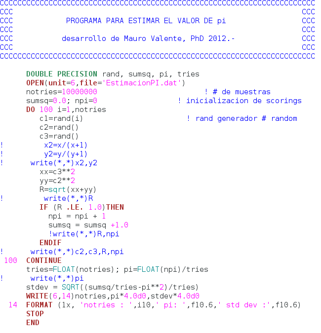
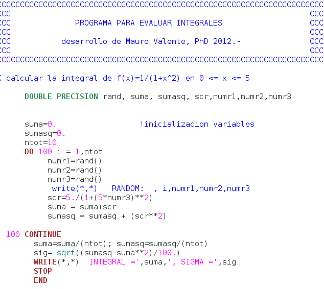

Aplicación de la técnica de simulación Monte Carlo
==================================================

El *Capítulo* presenta algunos ejemplos sencillos, pero
ilustrativos del modo en que puede aplicarse y aprovecharse la técnica
Monte Carlo con fines de cómputo numérico. se muestran algunas
aplicaciones genéricas, como estimación de números y cálculo de
integrales definidas. Por último se realiza un ejemplo de aplicación
simple respecto de cómo emplear el método Monte Carlo para modelar el
transporte de radiación.

Introducción
------------

Tal como se enunció en secciones precedentes, existe una amplia variedad
de problemas asociados al modelado del transporte de radiación, y que de
hecho se presentan en la práctica en muy diversos ámbitos, que carecen
de solución dentro del campo analítico, limitando el uso de “matemática
pura” para la resolución de los mismos.

Este es el caso, por ejemplo, de la resolución de algunas ecuaciones
íntegro-diferenciales. En particular, existen varios teoremas que
demuestran la gran limitación de los métodos analíticos para la
resolución directa de la ecuación de transporte de Boltzmann,
representada por la expresión `[EqX] <#EqX>`__. De hecho, se conoce como
resultado de teoremas que sólo puede resolverse la ecuación de
transporte de Boltzmann para una cantidad muy acotada de situaciones,
involucrando condiciones iniciales y de contorno que resultan muy poco
realistas en casos de aplicación concreto de problemas físicos.

Por tanto, se propone un método alternativo para encontrar soluciones a
la ecuación `[EqX] <#EqX>`__, para lo cual se considerará la
re-escritura del problema en modo particular para posteriormente aplicar
un procedimiento que consiste, básicamente, en el cálculo del valor de
una integral definida. De manera tal, que una vez replanteado
(re-ordenado) el problema éste se reducirá a la resolución de una
ecuación que contiene integrales definidas, y por tanto podría salvarse
la imposibilidad o inconveniencia de la aplicación de los métodos
tradicionales (analíticos) para la solución de diferentes tipos de
problemas, en los cuales se ven limitados debido, fundamentalmente, a:

-  Desconocimiento de una función primitiva de aquella que se desea
   integrar.

-  Si bien se conoce una función primitiva, resulta excesivamente
   compleja o extensa su aplicación.

La evaluación de estimadores, como por ejemplo para integrales
definidas, por medio el método de Monte Carlo se realiza aplicando el
siguiente teorema:

*Teorema:* Sean :math:`x_{1}, x_{2}, ..., x_{N}` :math:`N` variables
aleatorias independientes, idénticamente distribuidas, con función de
densidad :math:`f(x)`. Si :math:`g_{i}` son funciones de :math:`x_{i}`,
entonces:

.. math::

   \begin{aligned}
       G = \frac{1}{N} \sum_{i=1}^{N} g_{i}(x_{i})
    \label{EqZZZ1}\end{aligned}

es una variable aleatoria que verifica, el valor medio cumple con:

.. math::

   \begin{aligned}
       \langle G \rangle = \frac{1}{N} \sum_{i=1}^{N} \langle g_{i}(x_{i}) \rangle
    \label{EqZZZ2}\end{aligned}

y la varianza resulta:

.. math::

   \begin{aligned}
       \sigma ^{2} [G] = \frac{1}{N^{2}} \sum_{i=1}^{N} \sigma ^{2} [g_{i}(x_{i})]
   \end{aligned}

En particular, cuando todas las :math:`g(x_{i})` son idénticas, e
iguales a :math:`g(x)`, se tiene que:

.. math::

   \begin{aligned}
       \langle G \rangle = \langle g(x) \rangle
    \end{aligned}

y también:

.. math::

   \begin{aligned}
       \sigma ^{2} [G] = \frac{1}{N} \sigma ^{2} [g(x)]
   \end{aligned}

Por lo tanto, en virtud de la definición de valor medio (o esperanza
matemática) de :math:`g(x)`, puede escribirse en la forma:

.. math::

   \begin{aligned}
       \langle G \rangle = \langle \frac{1}{N} \sum_{i=1}^{N} g_{i}(x_{i}) \rangle \approx \int _{-\infty} ^{+ \infty} f(x) \, g(x) \; dx =
       \langle g(x) \rangle
    \end{aligned}

Este resultado justifica la siguiente forma de estimar una integral
definida: Muestrear una serie de números aleatorios :math:`x_{i}` con
función de densidad :math:`f(x)` y evaluar :math:`g(x)` para cada
:math:`x`. La media de los valores obtenidos para :math:`g(x)` es una
estimación de la integral. De acuerdo con el teorema de límite central
la varianza de esta estimación decrece con el número de términos, según
se deduce de la expresión `[EqZZZ5] <#EqZZZ5>`__ para
:math:`\sigma ^{2} [G]`:

.. math::

   \begin{aligned}
       \sigma = \frac{\sigma [g]}{\sqrt{N}}
    \label{EqZZZ7}\end{aligned}

Conviene tener presente la desigualdad de Tchebycheff, de modo que se
tiene:

.. math::

   \begin{aligned}
       P \left[ \lvert G - \langle G \rangle \rvert \ge \sqrt{\frac{\sigma ^{2} [g]}{N \, c}} \right] \le c
   \end{aligned}

De modo que se cuenta con argumento para tener una cota para la
probabilidad de obtener un error mayor que el propuesto en la estimación
del valor de la integral, pudiéndose siempre disminuir este error sin
más que aumentar el valor de :math:`N`.

Eficiencia del método Monte Carlo
---------------------------------

Se define la *eficiencia del método Monte Carlo* (:math:`\epsilon`)
como:

.. math::

   \begin{aligned}
       \epsilon \equiv \sigma ^{2} \, T
   \end{aligned}

donde :math:`T` es el tiempo de cálculo. Como el valor de :math:`T` está
fuertemente relacionado con el número de puntos usados en la
computación, se suele dar también esta otra definición para la
eficiencia:

.. math::

   \begin{aligned}
       \epsilon \equiv N \; \sigma ^{2}
    \label{EqZZZ10}\end{aligned}

Y, a partir de ésta, la eficiencia relativa (:math:`\epsilon_{rel}`):

.. math::

   \begin{aligned}
       \epsilon_{rel} \equiv \frac{\epsilon [N]}{\epsilon [N']} = \frac{N}{N'} \frac{\sigma ^{2}}{(\sigma') ^{2}}
   \end{aligned}

Si :math:`\epsilon_{rel} < 1`, entonces el método que corresponde a
:math:`N', (\sigma') ^{2}` es “mejor” que el método con
:math:`N, \sigma ^{2}`. Si el número de puntos utilizados es el mismo,
la eficiencia relativa queda reducida al cociente de las varianzas.

Cálculo-estimación del número :math:`\pi` por medio de técnicas Monte Carlo
---------------------------------------------------------------------------

Uno de los métodos más antiguos utilizados para estimar el valor de
:math:`\pi` es el método de Buffon, que emplea una serie de líneas
paralelas y una vara, cuya longitud guarda correlación con la separación
entre líneas, para ser arrojada y determinar el ángulo que forma éstas
con las líneas, así como la línea que atraviesa.

El método propuesto a continuación, representa una analogía al método de
Buffon.

Se considera un círculo de radio unidad centrado en el origen. El área
del círculo en el primer cuadrantes será :math:`\pi/4`. Un modo de
resolver este problema usando el método Monte Carlo con técnica
éxito-fracaso, también denominado método de rechazo, es el siguiente:

#. Generar un par de números aleatorios :math:`\zeta_{1}` y
     :math:`\zeta_{2}` uniformemente distribuidos en [0,1].

#. Determinar un punto en el primer cuadrante, de coordenadas
     :math:`(x, y)` a partir de :math:`\zeta_{1}` y :math:`\zeta_{2}`.

#. Determinar la distancia :math:`D` del punto :math:`(x, y)` al
     origen, :math:`D = \sqrt{x^{2} + y^{2}}`.

#. Examinar si la distancia :math:`D` es mayor o menor al radio
     :math:`R` (:math:`R = 1`).

#. Considerar con “éxito” los procesos que den lugar a puntos en el
     plano dentro de círculo y como “fracaso” los que estén fuera.

#. Calcular las proporciones de éxito y de fracaso.

A continuación, se muestra una propuesta [1]_ para un código de cómputo:

   **Figura 11:** Ejemplo sencillo de implementación en código para estimación del
   número :math:`\pi` con técnica Monte Carlo.

Ejemplos de cálculo de integrales definidas por medio del método Monte Carlo
----------------------------------------------------------------------------

Se considera diferentes procedimientos para calcular integrales
definidas por medio del método Monte Carlo. El primero se llama “Método
Monte Carlo de éxito-fracaso”, basado en la interpretación de una
integral como un área. El segundo se llama “método Monte Carlo de la
media muestral” y está basado en la definición de valor medio de una
variable aleatoria continua.

Método de éxito-fracaso con técnica Monte Carlo
~~~~~~~~~~~~~~~~~~~~~~~~~~~~~~~~~~~~~~~~~~~~~~~

Considérese el problema de calcular una integral unidimensional, donde
se asume que el integrando :math:`g(x)` es una función acotada:

.. math::

   \begin{aligned}
       0 \le g(x) \le c \, \; \, \; \forall x \in [a, b] \nonumber
    \label{EqZZZ12}\end{aligned}

Y sea :math:`\Omega` el rectángulo:

.. math::

   \begin{aligned}
       \Omega = \{ (x, y) \in \Re ^{2} | \: x \in [a, b] \; y \in [0, c] \} \nonumber
    \label{EqZZZ13}\end{aligned}

Y sea :math:`(X, Y)` una variable aleatoria uniformemente distribuida
sobre :math:`\Omega` con función de densidad:

.. math::

   \begin{aligned}
       f_{x \, y} (x, y) =   \left[ \begin{array}{c}
                               \frac{1}{c} \, (b -a) \: \: (x, y) \in \Omega  \\
                           0 \: \: (x, y) \notin \Omega  \nonumber
                               \end{array} \right]
    \label{EqZZZ14}\end{aligned}

Método de la media muestral con técnica Monte Carlo
~~~~~~~~~~~~~~~~~~~~~~~~~~~~~~~~~~~~~~~~~~~~~~~~~~~

Otra forma de calcular la integral, es representarla como el valor
esperado de una variable aleatoria. Se reescribe la integral definida
:math:`I` en la forma:

.. math::

   \begin{aligned}
       I = \int _{a} ^{b} \frac{g(x)}{f(x)} \, f(x) \: dx
    \label{EqZZZ15}\end{aligned}

Donde :math:`f(x)` una función de densidad correspondiente a la variable
aleatoria :math:`x`.

Entonces:

.. math::

   \begin{aligned}
       I = \langle \frac{g(x)}{f(x)} \rangle
    \label{EqZZZ16}\end{aligned}

Suponiendo que la variable aleatoria se distribuye según la siguiente
función de densidad:

.. math::

   \begin{aligned}
       f(x) =  \left[  \begin{array}{c}
                  \frac{1}{(b -a)} \: \: x \in [a, b]  \\
              0 \: \: x \notin [a, b]  \end{array} \right] \nonumber
    \label{EqZZZ17}\end{aligned}

donde :math:`x` uniformemente distribuida en [a, b].

Entonces:

.. math::

   \begin{aligned}
       I =  \int _{a} ^{b} g(x) \: d x = \int _{a} ^{b} \frac{1}{b -a} \, g(x) \, (b -a) \: d x =  (b - a) \langle g(x) \rangle
    \label{EqZZZ18}\end{aligned}

Por lo tanto, una estimación muestral de :math:`I` es:

.. math::

   \begin{aligned}
       I \approx (b - a) \frac{1}{N} \sum _{i=1} ^{N} g(x_{i})
    \label{EqZZZ19}\end{aligned}

Mientras que el estimador para la varianza :math:`\sigma ^{2}` es:

.. math::

   \begin{aligned}
       \sigma ^{2} [I] \approx \frac{1}{N - 1} \left[ \frac{\sum_{i=1} ^{N} (g(x_{i}))^{2}} {N}
                                                      - \left(\frac{\sum_{i=1} ^{N} g(x_{i})} {N}\right) ^{2} \right]
   \end{aligned}

Evaluación de integrales definidas
~~~~~~~~~~~~~~~~~~~~~~~~~~~~~~~~~~

A modo de ejemplo, puede calcularse
:math:`I = \int _{0} ^{5} \frac{dx}{1 + x^{2}}`.

Para ello, se recurre, por ejemplo, al método de muestreo según la
expresión `[EqZZZ19] <#EqZZZ19>`__, por lo tanto:

.. math::

   \begin{aligned}
       I = \int _{0} ^{5} \frac{dx}{1 + x^{2}} \approx \frac{(5 - 0)}{N} \, \sum _{i=1} ^{N} \frac{1}{ 1 + (x_{i})^{2}}
   \end{aligned}

A continuación, en la figura `[Fig7_2] <#Fig7_2>`__, se muestra una
propuesta [2]_ para un código de cómputo para evaluar la integral
:math:`I = \int _{0} ^{5} \frac{dx}{1 + x^{2}}`:

   **Figura 12:** Ejemplo sencillo de implementación en código para estimación de la
   integral definida :math:`I = \int _{0} ^{5} \frac{dx}{1 + x^{2}}` con
   técnica Monte Carlo.

El método Monte Carlo aplicado al transporte de radiación
---------------------------------------------------------

En la actualidad, prácticamente todas las áreas recurren al uso de
computadores para resolver problemas importantes, tanto de índole
social, económica, de ingeniería, de ciencia básica, aplicada, etc.

Con un manejo adecuado de programas de cómputo e información pueden
realizarse cálculos y simulaciones de modelos reales, para estudiarlos
y resolver problemas teóricos o de aplicación. Los procesos que
contienen variables aleatorias son susceptibles de abordarse con el
método Monte Carlo, que siendo método numérico capaz de explotar la
capacidad de los procesadores en computadores, puede aplicarse en
muchas tareas más de lo que se hacía en los principios de su
aplicación práctica (a principios de la década de 1950).

La simulación Monte Carlo es la mejor alternativa disponible en la
actualidad para resolver el problema del transporte de la radiación en
la materia cuando se trata con geometrías complejas, tales como las
que se encuentran en las diversas aplicaciones médicas que utilizan
radiaciones ionizantes.

En esta sección se aborda la aplicación del método Monte Carlo
específicamente en la simulación de la interacción de la radiación con
la materia, para investigar aspectos dosimétricos y de
radiodiagnóstico, de algunos problemas que existen en el área de
física médica.

En términos genéricos, puede decirse que la simulación es un
experimento teórico en el que se reproduce el comportamiento de un
sistema complejo, que consiste de una forma de “realizar” un
experimento en el cual la realidad es sustituida por un modelo
matemático.

Puede considerarse como un híbrido entre experimentación pura y
teórica y es una herramienta muy útil en la investigación científica.
En definitiva, lo que se hacen los métodos de simulación Monte Carrlo
aplicados al transporte de radiación es resolver la ecuación de
transporte de las partículas de una forma puramente estadística, lo
cual representa ventaja sobre los métodos analíticos complejos que
resuelven la ecuación de forma aproximada y sólo para problemas
sencillos.

La simulación Monte Carlo en física médica se utiliza para resolver
problemas diversos, como estudiar y reconstruir imágenes de pacientes
tomadas con equipos digitales, realizar cálculos de carcinogénesis,
obtener espectros de salida de unidades de terapia, caracterizar
detectores de radiación y fuentes de radiación ionizante de todo tipo.

Tracking de partículas con el método Monte Carlo
~~~~~~~~~~~~~~~~~~~~~~~~~~~~~~~~~~~~~~~~~~~~~~~~

La historia o trayectoria de una partícula es vista como una secuencia
aleatoria de desplazamientos libres que terminan con un evento de
interacción donde la partícula cambia su dirección de movimiento,
evenbtualmente modifica el estado de fase (pierde energía o cambia
dirección de movimiento, por ejemplo) y puede generar partículas
secundarias. Todo ello se realiza aplicando las leyes de la física,
atendiendo las funciones de probabilidad determinadas por las
secciones eficaces adecuadas y dependiendo del medio, la energía de la
partícula y la disposición geométrica del sistema.

A modo de ejemplo, se pueden simular condiciones extremas de un
reactor nuclear, sin hacerlo en una instalación real; o bien simular
la aplicación de un tratamiento de radioterapia a un paciente, sin
llevarlo a cabo hasta que se obtengan las dosis adecuadas en los
sitios convenientes en el simulador.

Se han desarrollado varios códigos de simulación Monte Carlo del
transporte de radiación que contienen modelos de interacción para
definir las funciones de distribución de probabilidad para las
distintas variables aleatorias que intervienen en cada proceso o
suceso, y que permiten obtener valores medios de observables de
interés como pueden ser la posición de las partículas después de cada
interacción, el momento y pérdidas de energía de las partículas
primarias o las secundarias generadas en algunas interacciones.

En forma genérica, el objetivo de los códigos de simulación es modelar
el camino seguido por partículas que atraviesan medios materiales,
atendiendo las leyes de la física y las probabilidades, a partir de
ciertas condiciones iniciales del estado de fase. El medio en el que
se lleve a cabo la simulación puede ser de estado sólido (generalmente
amorfo), líquido o gaseoso y el modelo geométrico del sistema se
define utilizando la geometría analítica.

Los códigos Monte Carlo de transporte tienen modelos de interacción
para las partículas que se van a simular, es decir, conjuntos de
secciones diferenciales transversales para los mecanismos de
interacción relevantes. Se definen funciones de distribución de
probabilidad para el camino libre entre interacciones, el tipo de
interacción que ocurre y el cambio del estado de fase, como pérdida de
energía y deflexión angular de las partículas.

Algunos de los códigos de simulación Monte Carlo más reconocidos para
el transporte de partículas en medios materiales son EGS4, EGSnrc,
PENELOPE, NOREC, MCNP, GEANT4 y FLUKA. Cada código tiene sus
particularidades puede resultar más conveniente para aplicaciones
distintas, por lo que se debe analizar cuál es el más adecuado al tipo
de problema, escogiendo el más sencillo de acuerdo con las habilidades
y capacidad de cómputo con que se cuente, y que contenga las secciones
eficaces o teorías físicas de respaldo más modernas para el tipo de
partícula a simular.

Para varias aplicaciones en radiodiagnóstico y radioterapia, la
utilización de simulación Monte Carlo del transporte de la radiación
resulta fundamentale incluso necesaria.

Para ejemplificar, en el caso de aplicaciones en radiodiagnóstico,
cuando un fotón o un electrón de energía elevada penetra en un medio
material origina una cascada de partículas secundarias, cuyo número va
en aumento al mismo tiempo que su energía media decrece. El inicio de
las simulaciones de estas cascadas electromagnéticas, inicia con el
trabajo de Berger en 1963, quien estableció las bases para realizar
estos cálculos de forma efectiva y sobre las que todavía se trabaja
hoy en día. Durante las décadas de 1970 y 1980 aparecieron los
primeros programas de propósito general capaces de simular el
transporte acoplado de fotones y electrones.

**Generación de trayectorias**

El proceso de simulación asume que las partículas siguen trayectorias
rectilíneas a velocidad constante entre dos interacciones sucesivas
con el medio. El modelado de su “vida” puede representarse como una
sucesión de estados determinados por la posición del n-ésimo suceso en
la posición :math:`\vec{r}_{n}`, la dirección de movimiento
:math:`\vec{\Omega}_{n}` y energía :math:`E_{n}` inmediatamente
después de producirse dicho suceso.

Dada una posición inicial, el primer punto a resolver es determinar a
qué distancia se producirá el siguiente suceso y, luego, de qué tipo
será. La primera cuestión se resuelve teniendo en cuenta el hecho de
que el viaje de una partícula constituye un proceso de Poisson; la
segunda, considerando la relación entre las secciones eficaces de las
diversas interacciones posibles.

Si :math:`\lambda_{i}` representa el recorrido libre medio (mfp)
correspondiente a la interacción de tipo “i”, y :math:`\lambda` el mfp
total (cuyo inverso es la suma de inversos de los recorridos libres
medios parciales), la distancia :math:`s` recorrida por la partícula
hasta el próximo suceso se determina mediante la expresión:

.. math::

   \begin{aligned}
       s = -\lambda \, \ln (\zeta)
   \end{aligned}

donde :math:`\zeta` es un número aleatorio uniformemente en [0, 1].

La probabilidad :math:`P_{i}` de que la interacción sea del i-ésimo
tipo es:

.. math::

   \begin{aligned}
       P_{i} = \frac{\lambda}{\lambda_{i}}
   \end{aligned}

Una vez sorteado el tipo de interacción a simular de acuerdo con las
probabilidades expresadas por en la ecuación `[EqZZZ23] <#EqZZZ23>`__,
es necesario simular el cambio de estado (típicamente dirección y
energía) que haya podido producirse. Para ello se emplea la
distribución de probabilidad asociada a la sección eficaz doble
diferencial correspondiente.

Por tanto, el proceso transforma el estado
:math:`(\vec{r}_{n}, \vec{\Omega}_{n}, E_{n})` al
:math:`(\vec{r}_{n+1}, \vec{\Omega}_{n+1}, E_{n+1})`. El proceso se
repite hasta que, o bien la partícula escapa del sistema material, o
bien su energía cae por debajo de cierto valor, momento en el cual se
supone que es localmente absorbida y su vida terminada. Tras simular
la vida de una partícula debe hacerse lo propio con las partículas
secundarias a las que haya dado lugar.

Modelado de colisiones e interacciones con el método Monte Carlo
~~~~~~~~~~~~~~~~~~~~~~~~~~~~~~~~~~~~~~~~~~~~~~~~~~~~~~~~~~~~~~~~

Los procesos de colisión se implementan en la técnica de simulación
Monte Carlo por medio de modelos de interacción que determinan las
secciones eficaces. Para ello, en las aplicacionmes típicas de
transporte de radiación ionizante, se requiere el conocimiento de las
secciones eficaces doble diferencial en energía y ángulo sólido. Los
valores de las secciones eficaces pueden ser introducidos en la
simulación Monte Carlo por medio de modelos análiticos que son
directamente evaluados para las variables de estado de cada caso; y
también puede emplearse tablas de valores obtenidas de bases de datos,
que requieren procesos posteriores para interpolar (asumiendo
continuidad) permitiendo obtener el valor correspondiente a las
variables de estado.

**Técnicas de simulación condensada**

En principio, el esquema de simulación anteriormente presentado es
válido para cualquier tipo de partícula. En la práctica, sin embargo,
no resulta adecuado cuando se consideran -por ejemplo- electrones de
alta energía, dado que el número de interacciones a lo largo de su
trayectoria antes de ser absorbidos resulta excesivamente elevado, del
orden de algunas decenas de miles para electrones de 1 MeV, por
ejemplo. Tal cantidad de colisiones requeriría un tiempo de simulación
tan grande que convierte a la solución propuesta al problema en algo
inviable.

El modo de resolver las dificultades derivadas de este inconveniente
se recurre a una técnica denominada “simulación condensada”, cuyo
fundamento se encuentra en las teorías de dispersión múltiple. La idea
consiste, básicamente, en simular el efecto global neto de un número
elevado de interacciones mediante un único suceso “artificial”. Exista
una variante, propuesta por Berger, conocida como simulación mixta,
que se combina la simulación detallada de los sucesos más “violentos”
con la condensada de los restantes, resultando un algoritmo
particularmente robusto y versátil.

Los diversos esquemas de simulación condensada constituyen quizás la
principal característica que distingue los programas de uso más
extendido. De hecho, la concepción de nuevos algoritmos más precisos y
más rápidos es uno de los temas de investigación abiertos en el campo
de la simulación Monte Carlo del transporte de la radiación.

**Cantidades de interés en la simulación de partículas**

Para obtener el valor medio de un observable :math:`Q`
(:math:`\langle Q \rangle`) por medio de simulación Monte Carlo, en el
transporte de radiación, conviene introducir el concepto de “historia”
entendida como la “vida” de una partícula primaria y la de todas las
secundarias generadas por ésta. A modo de ejemplo, podría tratarse de
la dosis en un cierto volumen de interés.

Sea :math:`q_{j}` a la contribución de la j-ésima historia, la
estimación del valor medio del observable (en el ejemplo, la energía
depositada por historia) tras simular un total de :math:`N` historias
proveé el siguiente estimador para :math:`q` para
:math:`\langle Q \rangle`:

.. math::

   \begin{aligned}
       \langle Q \rangle \sim q \equiv \frac{1}{N} \sum_{j=1} ^{N} q_{j}
    \label{EqZZZ24}\end{aligned}

que coincide con la expresión `[EqZZZ1] <#EqZZZ1>`__.

Ejemplo básico artificial de transporte con el método Monte Carlo
~~~~~~~~~~~~~~~~~~~~~~~~~~~~~~~~~~~~~~~~~~~~~~~~~~~~~~~~~~~~~~~~~

A modo de ejemplo extremamente sencillo, se propone realizar el
modelado por simulación Monte Carlo de una partícula libre moviéndose
en un plano. El problema conocido como *random walk* consiste en mover
una partícula con paso :math:`p` con características isotrópicas y
homogéneas para el medio en que se transporta la partícula.

Entonces, la distribución angular que corresponde al cambio en la
dirección de movimiento es isotrópica, y se busca, en general,
determinar la distancia neta recorrida al cabo de :math:`N`
movimientos.

Ejemplo sencillo de transporte con el método Monte Carlo: Columna de neutrones
~~~~~~~~~~~~~~~~~~~~~~~~~~~~~~~~~~~~~~~~~~~~~~~~~~~~~~~~~~~~~~~~~~~~~~~~~~~~~~

El transporte de neutrones, por ejemplo, puede implementarse siguiendo,
a grandes líneas según el esquema:

#. Definición de la geometría del problema.

#. Definición de la fuente.

#. Selección del tipo de partícula para la fuente.

#. Determinación de la posición de colisión.

#. Determinación del tipo de interacción.

#. Determinación del resultado de la interacción.

#. Finalización de la historia de los secundarios.

#. Cálculo de los estimadores.

A modo de ejemplo, se considera una fuente puntual que emite un pulso,
es decir una función :math:`\delta`, neutrones en la dirección :math:`z`
y está inmersa en un medio material homogéneo e isotrópico. Se considera
como geometría una esfera de radio :math:`R` y ausencia de absorción y
el movimiento de las partículas es siempre en dirección :math:`z`
alejándose de la fuente. Estimar la cantidad de interacciones que
ocurren dentro de la geometría, introduciendo el modelado y parámetros
que sean necesarios.

.. [1]
   El código es sólo para propósitos ilustrativos. No se encuentra
   preparado de modo eficiente ni optimizado.

.. [2]
   El código es sólo para propósitos ilustrativos. No se encuentra
   preparado de modo eficiente ni optimizado.
