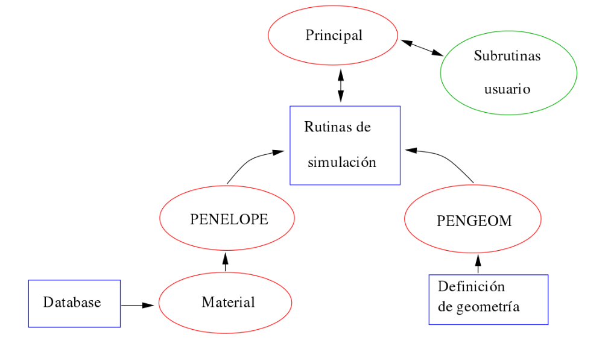
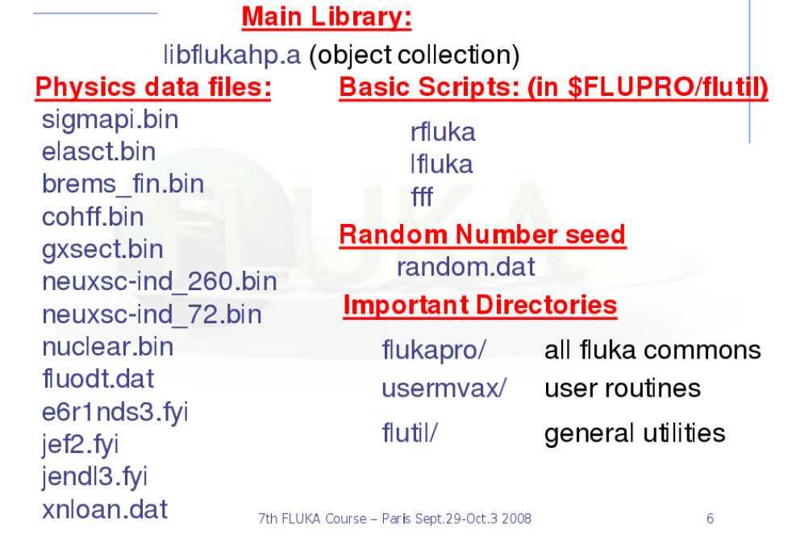

Descripción de las configuraciones radiológicas en simulaciones Monte Carlo
===========================================================================

El presente capítulo se trata sobre una breve introducción a códigos de
simulación Monte Carlo dedicados al transporte de radiación. Se
presentan las características genéricos de los códigos PENELOPE y FLUKA.
La exposición se enfoca en la posibilidad de realizar aplicaciones en
radiodiagnóstico.

Introducción y parámetros en la simulación del transporte de radiación
----------------------------------------------------------------------

Como se mencionó en las secciones precedentes, los métodos Monte Carlo
son una forma genérica para denominar procedimiento matemáticos cuya
característica común es el uso de números generados aleatoriamente y
distribuciones de probabilidad. En la actualidad el método Monte Carlo
es ampliamente aceptado y cada vez mas extendido, como una herramienta
para realizar investigación científica, específicamente para modelar el
transporte de radiación en medios materiales.

En muchos casos de interés en el campo de rediodiagnóstico, como una
situación particular del transporte de radiación, el método Monte Carlo
es el más apropiado, ya que no se dispone de métodos alternativos de
carácter experimental, anlítico y/o instrumental.

Setups virtuales
----------------

El método Monte Carlo puede resultar fácilmente aplicable a sistemas con
geometrías complejas y diferentes medios materiales. De hecho, éste
método permite simular el paso de la radiación a través de la materia
tomando en cuenta todos los procesos físicos relevantes y todos los
tipos de radiación involucrados, como tipo de partículas (electrones,
positrones, fotones, neutrones, iones pesados y partículas como muones,
kaones, etc) que pueden ser simulados hasta que se detengan.

En términos genéricos, el armado de la configuración de irradiación
requiere de definir la fuente de radiación (en propiedades físicas y
geométricas), la muestra que es irradiada (en geometría y propiedades
físicas), los sistemas de etección, con las propiedades definidas por el
usuario, así como determinar cuáles son los procesos, y bajo qué
critarios, se consideran en la simulación.

A modo de fijar ideas, se presenta el diseño del set up de uuna
situación típica en radiodiagnóstico, como es la simulación de un tubo
de rayos X:

|    La geometría que debe simularse para el proceso de producción de
    rayos X se corresponde con el dispositivo típico de un tubo de rayos
    X. En primer lugar, se define la fuente de electrones mediante ( por
    ejemplo mediante fuentes puntuales ubicadas a lo largo de una
    longitud de 2 mm). Los electrones viajan en l’inea recta hacia el
    ánodo de material (por ejemplo, tungsteno con espesor de 0.5 mm y
    ángulo de inclinación de unos 10 - 15 grados). Cuando los electrones
    ingresan en el material blanco el programa simula la trayectoria de
    los electrones hasta que éstos finalmente llegan al “reposo” o a una
    situación terminal. Durante los procesos de interacción se considera
    la producción de rayos X característicos y Bremsstrahlung. Los
    fotones que emergen del blanco atraviesan la envoltura de vidrio
    pirex de 0.5 mm de espesor, y finalmente el filtro adicional de
    aluminio de 1 mm de espesor.

El espectro calculado representa el número de fotones por intervalo de
energía en función de la energía. Los resultados pueden ser obtenidos
con los códigos PENELOPE o FLUKA, entre otros.

Ejemplos de códigos de simulación Monte Carlo para transporte de radiación
--------------------------------------------------------------------------

Existen disponibles varios códigos de simulación dedicados a modelar el
transporte de radiación. Algunos de los códigos más utilizados en
aplicaciones de física médica son MCNP, EGS4, GEANT4, PENELOPEy FLUKA.

En general, los código de simulación Monte Carlo construyen un modelo
estocástico en base a funciones de densidad de probabilidad modelando
secuencialmente eventos individuales de una variable aleatoria. Es
decir, teóricamente se siguen todos los eventos o interacciones que
sufre cada partícula desde su origen hasta que alcanza una condición
terminal (absorción, escape, energía de corte, etc).

Para cualquier evento, los códigos de simulación generan un número
aleatorio fundamentándose en las funciones de densidad de probabilidad,
que definen el tipo de interacción y otros parámetros. Posteriormente,
se calcula el valor esperado de todos los eventos simulados.

Para realizar una simulación, debe crearse un archivo de entrada,
típicamente denominado “input”. Este archivo contiene de manera
estructurada información sobre el problema en aspectos tales como la
geometría del problema, materiales utilizados, secciones eficaces a
utilizar, la localización y características de la fuente y los tipos de
resultados que se desea obtener de la simulación.

El código PENELOPE v. 2008
~~~~~~~~~~~~~~~~~~~~~~~~~~

El código PENELOPE refiere a PENetration and Energy LOss of Positrons
and Electrons (luego se incorporaron fotones).

Algunas de las principales caracteríaticas son:

-  Cascadas acopladas de tipo “fotón-electrón”.

-  Transporte de fotones por medio de simulación detallada, que refiere
   a computar evento por evento.

-  Transporte de electrones/positrones por medio de simulación mixta,
   i.e. en combinación entre simulación detallada y técnicas denominadas
   “simulación condensada”, que consisten básicamente de implementar
   criterios para acumular una serie de eventos en único evento
   equivalente -estadísticamente-. Para ello, se cuenta con formalismos
   teóricos denominados multiple scattering theory.

-  El rango de energía disponible en PENELOPE es 50 eV a 1 GeV.

-  Las partículas secundarias que se generan son simuladas en orden
   cronológico.

Existen, cuatro estructuras o bloques principales:

-  **Input:** Se requiere de un archivo de inicialización para ingresar
   los datos de entrada.

-  **Modelado de eventos de colisión:** Simulación de interacciones.

-  **Algoritmos internos de cómputo:** Rutinas numéricas asociadas al
   proceso de cómputo.

-  **Modelo de tracking:** Transporte de la radiación.

Al iniciar la simulación, PENELOPE lee el archivo de input, realiza la
simulación y, como resultado, crea archivos nuevos de salida denominados
“outputs”, que incluyen los resultados generados, estimaciones para los
errores producidos y algunas tablas que resumen el proceso de
simulación.

La figura muestra esquemáticamente el
diagrama de flujos del código PENELOPE.

   **Figura 13:** Diagrama esquemático de la estructura de PENELOPE.

La base de datos de PENELOPE cuenta con 279 materiales, entre elementos
puros y compuestos.

El código FLUKA v. 2011
~~~~~~~~~~~~~~~~~~~~~~~

El proyecto FLUKA pertence al CERN, y es desarrollado para propósitos de
física de partículas de alta energía, alcanzando valores de hasta varias
decenas de TeV, o incluso mayores con linking a nuevas librerías
restringidas.

En términos generales, FLUKA is un paquete integral de simulación de
física de partículas. Cuenta con varios campos de aplicación que
incluyen, entre otros, física teórica y experimental de alta energía,
ingeniería, diseño de infraestructuras y protecciones (shielding),
diseño de telescopios y detectores, estudios de rayos cósmicos,
dosimetría, física médica y radiobiología.

En cuanto a su capacidad, brevemente FLUKA puede simular con gran
precisión todos los procesos de interacción y propagación de más de
sesenta tipos de partículas, entre ellas fotones y electrones,
neutrinos, muones de varias cantidades de energía, hadrones, así como de
sus correspondientes antipartículas.

La figura muestra esquemáticamente el
contenido central del paquete FLUKA.

   **Figura 14:** Contenido básico de FLUKA.
